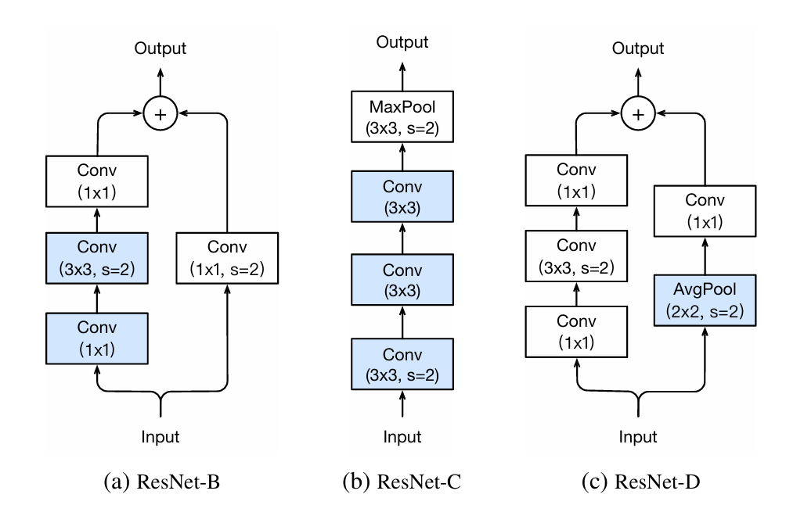

# Bottleneck ResNet16-2DD
<div style="display: flex; gap: 10px; flex-wrap: wrap; margin-bottom: 10px;">
    
    
    
    
</div>
<br/>

BResNet16-2DD is a custom 2D deep learning architecture inspired by ResNet but designed with efficiency in mind. Unlike conventional ResNet models, which use basic residual layers (for ResNet-18 and ResNet-34) and bottleneck residual layers (for ResNet-50 and above), BResNet16 is optimized for lightweight performance, making it ideal for edge devices and performance-critical applications.

## Architectural Design
In traditional ResNet architectures:
- **Basic residual layers** stack two convolutional layers on the main path and one convolutional layer on the shortcut path. These blocks, while effective, have relatively high computational demands.
- **Bottleneck residual layers** stack three convolutional layers on the main path, with the first and last layers being 1x1 convolutions (bottleneck layers) to reduce computation.

### Why "16"?
A conventional ResNet model has an input stem, four stages, and an output layer. Each stage typically contains at least two residual blocks, making it impossible to create standard 18 and 34 variants using only bottleneck layers. The closest possible variant is 16, hence the name **BResNet16 (Bottleneck Residual Network 16).**

### Key Modifications
To maintain efficiency while preserving the essential structure of ResNet, each stage in BResNet16 contains only a single Bottleneck Residual Block instead of the usual two. The stages are defined as follows:

```python
# Backbone
self.block = BottleneckResidual2DD(filters=64, strides=(1, 1))
self.block1 = BottleneckResidual2DD(filters=128, strides=(2, 2))
self.block2 = BottleneckResidual2DD(filters=256, strides=(2, 2))
self.block3 = BottleneckResidual2DD(filters=512, strides=(2, 2))
```

## Enhancements
BResNet16 incorporates improvements from the paper ["Bag of Tricks for Image Classification with Convolutional Neural Networks"](https://arxiv.org/abs/1812.01187) alongside additional optimizations to enhance efficiency and performance.

This repository also includes implementations of the Hardswish and Mish activation functions:

- [Searching for MobileNetV3](https://arxiv.org/abs/1905.02244)
- [Mish: A Self Regularized Non-Monotonic Neural Activation Function](https://arxiv.org/abs/1908.08681)

The codebase is fully integratable inside the TensorFlow and Keras code pipelines.

## Key Enhancements
- **Modified Stem:** Utilizes three convolutional layers instead of a single one.
- **ResNet-B Inspired Strides:** Moved the stride placement in the residual blocks from the first convolution to the second.
- **ResNet-D Inspired Shortcut:** Introduces an average pooling layer before the 1x1 convolution in the shortcut connection.
- **Modified Channel Count:** The number of channels has been adjusted to better maintain a compact model size. Specifically, the filter count in the first two layers in the main path is reduced by a factor of 4, creating a squeeze-and-expansion effect (the final output channel count remains scaled by a factor of 4).

<br/>
<br/>
<div align="center" style="display: flex; justify-content: center; align-items: center;">
    
</div>
<br/>

*Note: The image is sourced from the referenced paper.*

## Installation & Usage
This code is compatible with **Python 3.12.8** and **TensorFlow 2.18.0**.

```python
from BResNet161DD import BResNet161DD


model = BResNet162DD()
model.build((None, 256, 256, 3))
model.summary()
```

### Model Summary Example
```bash
Model: "b_res_net162dd"
┏━━━━━━━━━━━━━━━━━━━━━━━━━━━━━━━━━━━━━━┳━━━━━━━━━━━━━━━━━━━━━━━━━━━━━┳━━━━━━━━━━━━━━━━━┓
┃ Layer (type)                         ┃ Output Shape                ┃         Param # ┃
┡━━━━━━━━━━━━━━━━━━━━━━━━━━━━━━━━━━━━━━╇━━━━━━━━━━━━━━━━━━━━━━━━━━━━━╇━━━━━━━━━━━━━━━━━┩
│ conv2d_layer (Conv2DLayer)           │ (None, 128, 128, 32)        │             864 │
├──────────────────────────────────────┼─────────────────────────────┼─────────────────┤
│ conv2d_layer_1 (Conv2DLayer)         │ (None, 128, 128, 32)        │           9,216 │
├──────────────────────────────────────┼─────────────────────────────┼─────────────────┤
│ conv2d_layer_2 (Conv2DLayer)         │ (None, 128, 128, 64)        │          18,432 │
├──────────────────────────────────────┼─────────────────────────────┼─────────────────┤
│ max_pooling2d (MaxPooling2D)         │ (None, 64, 64, 64)          │               0 │
├──────────────────────────────────────┼─────────────────────────────┼─────────────────┤
│ bottleneck_residual2dd               │ (None, 64, 64, 256)         │          23,808 │
│ (BottleneckResidual2DD)              │                             │                 │
├──────────────────────────────────────┼─────────────────────────────┼─────────────────┤
│ bottleneck_residual2dd_1             │ (None, 32, 32, 512)         │         164,864 │
│ (BottleneckResidual2DD)              │                             │                 │
├──────────────────────────────────────┼─────────────────────────────┼─────────────────┤
│ bottleneck_residual2dd_2             │ (None, 16, 16, 1024)        │         659,456 │
│ (BottleneckResidual2DD)              │                             │                 │
├──────────────────────────────────────┼─────────────────────────────┼─────────────────┤
│ bottleneck_residual2dd_3             │ (None, 8, 8, 2048)          │       2,637,824 │
│ (BottleneckResidual2DD)              │                             │                 │
├──────────────────────────────────────┼─────────────────────────────┼─────────────────┤
│ global_average_pooling2d             │ (None, 2048)                │               0 │
│ (GlobalAveragePooling2D)             │                             │                 │
├──────────────────────────────────────┼─────────────────────────────┼─────────────────┤
│ dense (Dense)                        │ (None, 256)                 │         524,544 │
└──────────────────────────────────────┴─────────────────────────────┴─────────────────┘
 Total params: 4,039,008 (15.41 MB)
 Trainable params: 4,039,008 (15.41 MB)
 Non-trainable params: 0 (0.00 B)
```

## License
This work is under an [MIT](https://choosealicense.com/licenses/mit/) License.